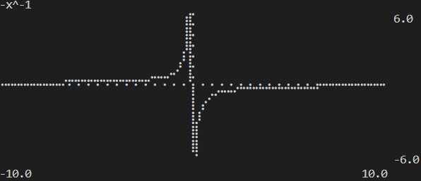

# computer-v2-v2

## Run
You need rust and Cargo, then launch:    
`cargo run --release`

## Commands

|Input|arguments|description|
|:-|:-|:-|
|/history|`<?pattern>`|display all history or filtered if patern is given|
|/list|`<?ima> <?fn> <?rat> <?mat>`|list all variables sorted by type or selected one|
|/clear|`<?history> <?variables> <?*>`|clear history and variables or only selected one|
|/chart|`<?on> <?off>`|toggle chart|
|/help|`<?cmd> <?ass> <?calc> <?*>`|display helping message about commands, assignation and calculus|

## Assignation
Assign a variable or a function to use it in calculus after.

|type|syntax|
|:-|:-|
|Rationnal|`myRatVar = 32 + 10`|
|Imaginary|`myImaVar = (32 + 10) * i`|
|Matrix|`myMatrix = [[1,2,3];[4,5,6];[7,8,9]] * 2`|
|Function|`myFn(myFnVar) = (32 + myFnVar) * 10`|

## Calculus
### Simple
To do a calculus simply use:   
`-2 + 32 + 3*4 = ?`   
This will give you `42`

### Variables and functions
You can use variables and function:   
`f(a) + f(x) - a = ?`    
will give you `42 + 4x`    
where:     
`f(var) = var * 2 + x`    
`a = 42`

You can wrap functions like this:    
` f(f(a)) = ?`    
will give you `3x + 168`

### operators

|sign|value|
|:-:|:-|
|+|add|
|-|substract|
|*|multiply|
|/|divide|
|^|power|
|%|modulus|
|**|matricial multiplication|

## Some cool things
toggle chart with     
`/chart on`     
then    
`-1 / x = ?`    
will give you   
